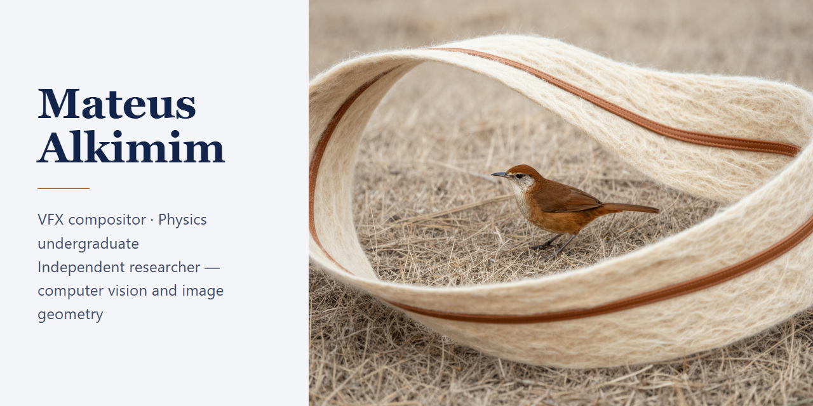
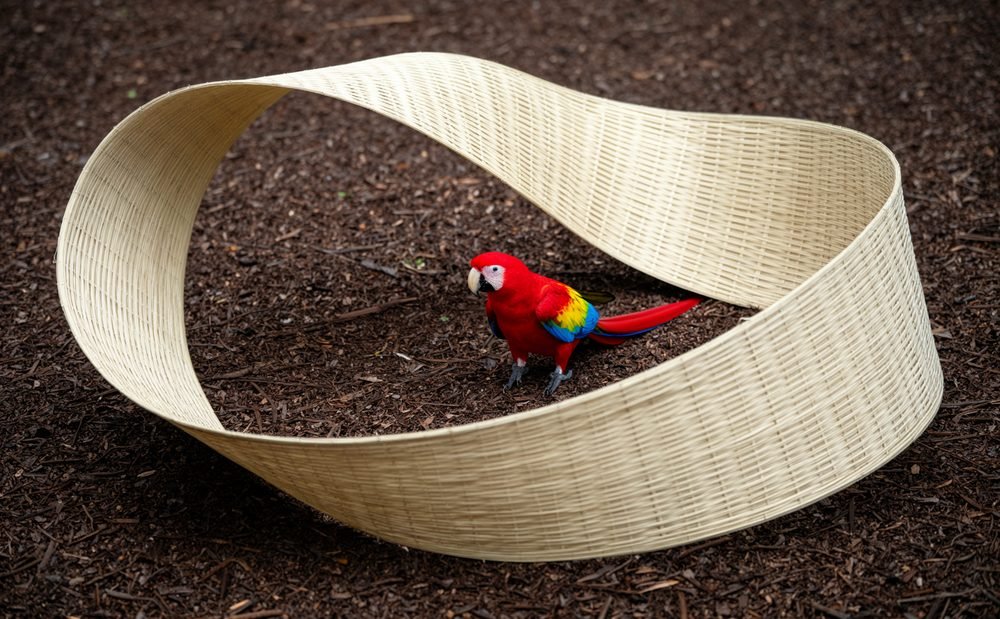
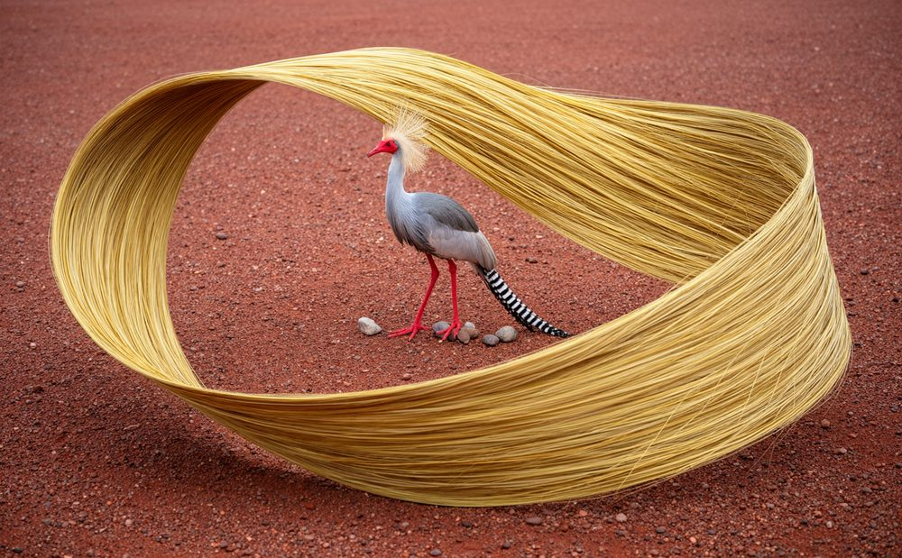
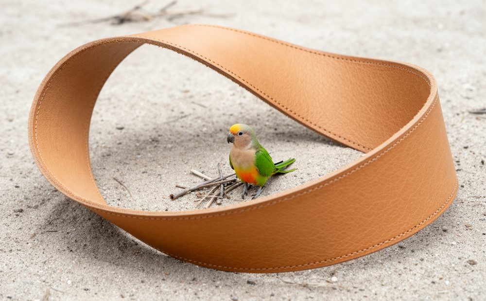
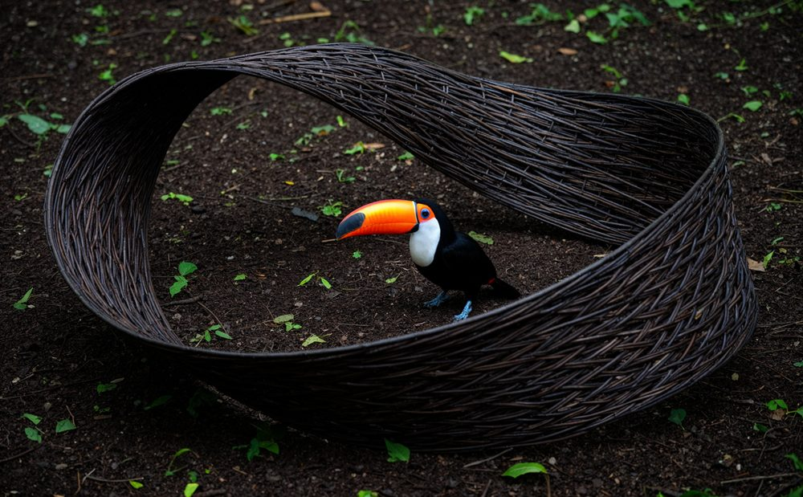
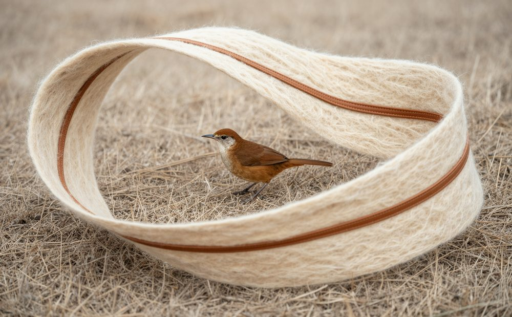
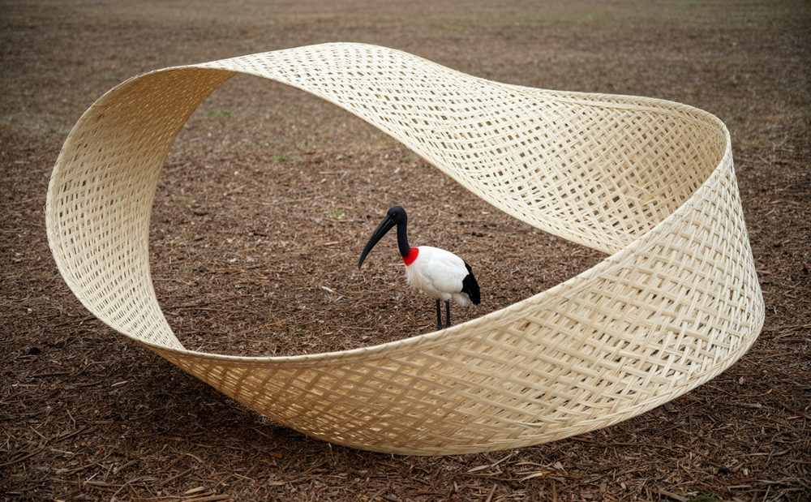

<!-- idioma: linha gerada por i18n.py -->
> [!NOTE]
> ### 🌍 **[Read this page in English →](README.md)**

# Mateus Alkimim

**Compositor de Efeitos Visuais · Pesquisador independente, visão computacional e  
geometria de imagem · Estudante de física** — Montes Claros, Brasil

Mediço imagens. Meu trabalho vive na ponte entre a produção de VFX e  
matemática: compositing que fecha tomadas, ferramentas de pipeline que os estúdios  
adotam, e geometria que verifica o que o olho acredita.

## Comece aqui

- **[relativity-paradox-lab](https://github.com/mateusalkimim/relativity-paradox-lab)** —
  um instrumento de ensino interativo de Relatividade Especial (Godot 4, controlado por gamepad),
  construído para sessões ao vivo de 20 minutos com audiências do ensino médio. Baseado em
  Alencar et al. (2023); desenvolvido a partir do trabalho do nosso grupo de pesquisa sobre o Paradoxo dos Gêmeos apresentado no III Congresso Internacional de Educação e Inovação (Unimontes, 2025). GPLv3.
- **[math-prerequisite-map](https://github.com/mateusalkimim/math-prerequisite-map)** —
  um mapa interativo de pré-requisitos de matemática do ensino superior
  ([ao vivo](https://mateusalkimim.github.io/math-prerequisite-map/)): 50 disciplinas,
  78 dependências em 13 camadas, e **nenhum caminho sem justificativa** — cada seta declara de qual livro veio e em que classe de evidência se baseia. O layout é medido, não desenhado: as interseções são reduzidas de 102 para 41, contadas no rodapé da própria página. Publicado como proposta, em português. MIT + CC BY-SA.
- **[seeing-calculus](https://github.com/mateusalkimim/seeing-calculus)** —
  nove instrumentos interativos que, em ordem, construem o fundamento visual do cálculo
  ([ao vivo](https://mateusalkimim.github.io/seeing-calculus/)): canvas e aritmética,
  sem biblioteca, sem rede, nada sai da máquina. Cada um é construído de modo que sua afirmação possa ser **verificada com uma régua** — quando uma figura diz que a derivada é a tangente de um ângulo, ela desenha o círculo e a curva na mesma escala e na mesma linha zero, de modo que as duas medidas que a equação compara são duas medidas iguais em pixels. Um gate garante o que a ordem promete: nenhum símbolo é usado antes de um instrumento anterior declará-lo, e ele funciona com um controle negativo. Em português. MIT + CC BY-SA.
- **[abstraction-ladder](https://github.com/mateusalkimim/abstraction-ladder)** —
  um mapa de computação que admite apenas o que alguém leu
  ([ao vivo](https://mateusalkimim.github.io/abstraction-ladder/)): do eletromagnetismo ao computador de registro, **cada seta abre a sentença que a sustenta**, copiada do livro com seu capítulo. A garantia é estrutural — o gerador *aborta* se uma aresta chega sem citação — e um verificador separado verifica cada citação contra a fonte, passagem por passagem; **nunca retorna "ok" por falta de prova**, e diz 35 de 36, não "todos", porque um livro ainda não está no estante. As arestas são prospectadas por um modelo local e depois controladas: de 48 propostas, 46 passaram pelo gate verbatim e 34 passaram pelo meu julgamento, com os 12 descartes registrados um a um com o motivo. Um modelo pode encontrar; não pode afirmar. Em português. MIT + CC BY-SA.
- **[geometry-verifies](https://github.com/mateusalkimim/geometry-verifies)** —
  a ferramenta de metrologia geométrica por trás da minha pipeline de pintura em matte:
  metrologia de uma única vista (Criminisi, Reid & Zisserman, 2000) verificando
  pinturas assistidas por IA contra a verdade no terreno da câmera — medições pré-registradas,
  julgamento cego, recibos para cada afirmação. MIT + CC BY.

## O que eu construo no trabalho

Compositor VFX na **Bóson Post** (anteriormente CONSULADO), trabalhando remotamente de Montes Claros. Além do trabalho de cena, construo ferramentas de pipeline em uso de produção (compartilhadas aqui como capacidade, não como código — o trabalho do cliente permanece sob NDA):

- um **conjunto de integração Kitsu ↔ Nuke** para configuração de cena e versionamento;
- um **mentor de composição determinístico** para Nuke — conselhos baseados em modelo, sem APIs externas, nada sai da máquina;
- **construtores de topologia de projeto procedurais** para estruturas de pastas de pipeline.

## Créditos selecionados

Produções lançadas nas quais trabalhei como compositor, e o estúdio por qual  
cada entrega passou (títulos e estúdios são créditos públicos; tomadas e  
desdobramentos permanecem sob NDA) — mais recente primeiro:

- **[O Gênio do Crime](https://www.imdb.com/title/tt39444949/)** (2026) —
  feature film (Boutique Filmes/Globo Filmes, from João Carlos Marinho's 1969
  classic), theatrical release; **my first on-screen film credit** — via [Bóson Post](https://www.bosonpost.com.br/) ·
  
- **[Passinho: O Ritmo dos Sonhos](https://www.imdb.com/title/tt30699615/)** (2025) —
  dance series, Disney+ Brazilian original; my first project with Bóson Post — via [Bóson Post](https://www.bosonpost.com.br/) ·
  
- **[Amor da Minha Vida](https://www.imdb.com/title/tt27517632/)** (2024–) —
  romantic comedy series, Disney+'s biggest Brazilian series debut of 2024 — via [The End](https://theend.tv/) ·
  
- **[A Magia de Aruna](https://www.imdb.com/title/tt16225592/)** (2023) —
  fantasy series, Disney+ Brazilian original — via [Miracle VFX](https://miraclevfx.com/) ·
  
- **[DNA do Crime](https://www.imdb.com/title/tt22459586/)** (2023–) —
  action/heist series, #1 on Netflix in 71 countries in its first season — freelance ·
  

## O que estou fazendo e estudando

**Guariba** — uma série animada original que estou escrevendo, dirigindo e produzindo,
ambientada nas planícies alagadas do Pantanal. Seu método de produção é onde minhas duas artes
se encontram: **3D descarta, a tinta difunde, a geometria projetiva verifica.** A IA está
nos bastidores e apenas como referência — os quadros finais são pintados, e essa fronteira é declarada.

**Física na Unimontes (2025–2028)** — deliberadamente, em paralelo com  
produção: geometria projetiva, álgebra linear e óptica são as ferramentas que uso  
diariamente no compositing, então estou aprendendo-as na raiz.

## Seis biomas, uma superfície

Seis faixas de Möbius, cada uma feita do material de um bioma brasileiro, cada uma segurando  
um pássaro que vive lá. A superfície é a mesma em todas as seis; o que muda é a  
matéria, e a matéria pertence ao lugar. Pesquisa minha, não remunerada, em andamento.

| | | |
|:--:|:--:|:--:|
|  |  |  |
| **Amazônia** — fibra de palmeira arumã · arara-azul | **Cerrado** — grama dourada capim-dourado · seriema-de-pernas-vermelhas | **Caatinga** — couro curtido vegetal · periquito-da-caatinga |
|  |  |  |
| **Mata Atlântica** — videira e junco taboa · tucano-de-crista | **Pampa** — lã e couro guasca cru · hornero-de-peito-rufous | **Pantanal** — palha de palmeira carandá · jabiru |

O problema difícil não foi gerar as imagens. Foi **escala**. Nas primeiras versões, o tucano
saiu quase do tamanho de uma folha caída, e o jabiru — mais alto que uma pessoa sentada —
parecia menor que o lixo aos seus pés. O chão estava sendo pintado na mesma escala aparente
toda vez, enquanto as espécies variam de um hornero de 13 cm a um jabiru de 130 cm: dez vezes
entre as extremidades.

A correção foi tratar o pássaro como a régua. É o único objeto na cena  
cujo tamanho real é conhecido, porque a espécie é declarada; fixe sua altura na  
imagem e todas as outras escalas seguem por divisão. O que me surpreendeu é que  
a correção não veio da troca das fotografias de referência — veio de uma melhor  
descrição. *"Toda folha caída é mais curta que o bico do arara"* funciona onde  
*"folhas pequenas"* falha.

Imagens geradas, declaradas como tal — [créditos e atribuição CC BY](media/CREDITS.md)  
para as fotografias de referência do solo.

## Ensino

- **[Nuke: Composição e VFX](https://unhideschool.com/cursos/view-all/6621/nuke-composicao-e-vfx)** —
  um curso gravado na Unhide School, onde sou o autor e instrutor.
  Ensinar é a outra metade da medição: o mesmo instinto por trás
  do relativity-paradox-lab, apenas direcionado para minha própria arte.

## Encontre-me

[mateusalkimim.com](https://mateusalkimim.com) ·
[LinkedIn](https://www.linkedin.com/in/mateus-alkimim-b93b80223)
